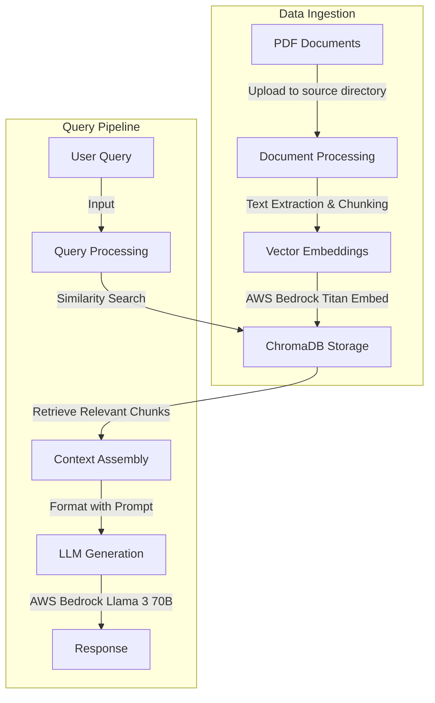

# 🤖 RAG Application

A Retrieval-Augmented Generation (RAG) application built with LangChain and AWS Bedrock.


## 📋 Overview

This application implements a RAG system that:
- 📄 Processes PDF documents as knowledge sources
- 🔢 Creates vector embeddings using AWS Bedrock
- 💾 Stores embeddings in a ChromaDB vector database
- 🔍 Retrieves relevant context based on user queries
- ✨ Generates responses using LLMs (currently Meta Llama 3 70B) via AWS Bedrock

## 🔧 Prerequisites

- Python 3.11+
- AWS account with Bedrock access
- AWS credentials configured locally

## 🚀 Installation

1. Clone the repository
2. Create a virtual environment:
   ```bash
   # Using conda
   conda create -n rag-app python==3.11 -y
   conda activate rag-app
   
   # OR using uv
   uv venv
   source .venv/bin/activate  # On Unix/macOS
   # .venv\Scripts\activate    # On Windows
   ```
3. Install local package & its dependencies:
```bash
pip install -e .
```
4. Install requirements:
```bash
pip install -r requirements.txt
```

## 📚 Usage

### 📥 Adding Documents

1. Place PDF documents in the `src/data/source` directory
2. Create or update the vector database:
   ```bash
   python create_db.py
   ```

To reset the database:
   ```bash
   python create_db.py --reset
   ```

### 🔎 Querying the RAG System

```python
from src.rag_app.query_rag import query_rag

response = query_rag("How can I contact support?")
print(response.response_text)
```

## 🏗️ Project Structure

- `src/rag_app/` - Core application code
  - `get_embeddings.py` - AWS Bedrock embedding functions
  - `get_chroma_db.py` - ChromaDB vector store interface
  - `query_rag.py` - RAG query processing logic
- `src/data/` - Data directories
  - `source/` - Source PDF documents
  - `chroma/` - ChromaDB vector database

## Configuration
- The application uses amazon.titan-embed-text-v1 by default. To change the model, modify the `modelId` in `src/rag_app/get_embeddings.py`.
- The application uses Meta Llama 3 70B by default. To change the model, modify the `BEDROCK_MODEL_ID` in `src/rag_app/query_rag.py`.

### Docker Image

A Dockerfile is provided for easy deployment. Build the image:
```bash
docker build --platform linux/amd64 -t aws_rag_app .
```

Run the container and verify the aws credentials are working:
```bash
docker run --platform linux/amd64 --rm -it -p 8000:8000     --env-file .env     --entrypoint python    aws_rag_app test_aws_credentials.py
```
OR

Run the container with local aws credentials and verify the aws credentials are working:
```bash
docker run --platform linux/amd64 --rm -it    -p 8000:8000    -v ~/.aws:/root/.aws    --entrypoint python    aws_rag_app src/app_api_handler.py
```

### Running Locally the Docker Container
```bash
docker run --platform linux/amd64 --rm -it   -p 8000:8000     --env-file .env    --entrypoint python     aws_rag_app src/app_api_handler.py
```

- Access the API at http://localhost:8000/docs.

## 🔄 Workflow



The workflow above illustrates the two main processes in the RAG application:

1. **Data Ingestion**: PDF documents are processed, chunked, embedded, and stored in the vector database
2. **Query Pipeline**: User queries are processed, relevant context is retrieved, and responses are generated using the LLM

## 👥 Contributing

Contributions are welcome! Please feel free to submit a Pull Request.

1. Fork the repository
2. Create your feature branch (`git checkout -b feature/amazing-feature`)
3. Commit your changes (`git commit -m 'Add some amazing feature'`)
4. Push to the branch (`git push origin feature/amazing-feature`)
5. Open a Pull Request

## ❤️ Made with Love

Built with passion for efficient knowledge retrieval and natural language processing.

If you find this project useful, please consider giving it a star ⭐
